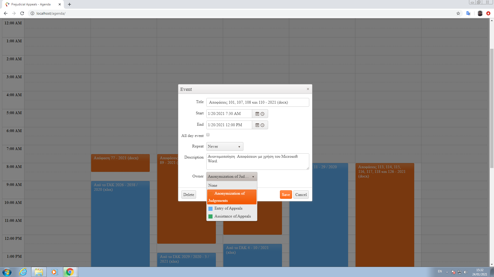
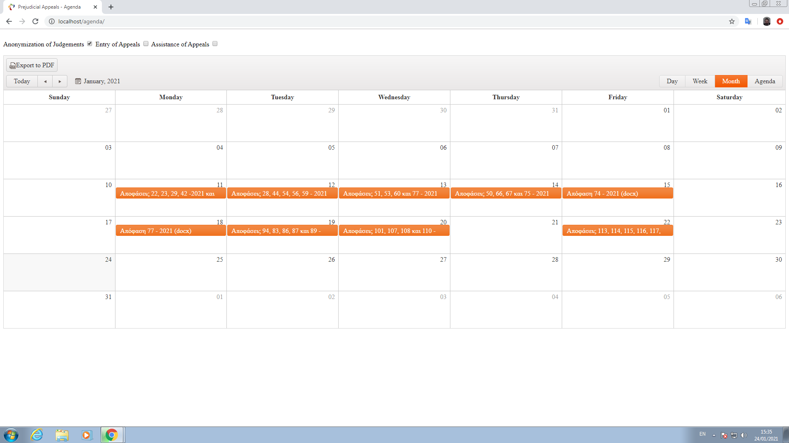
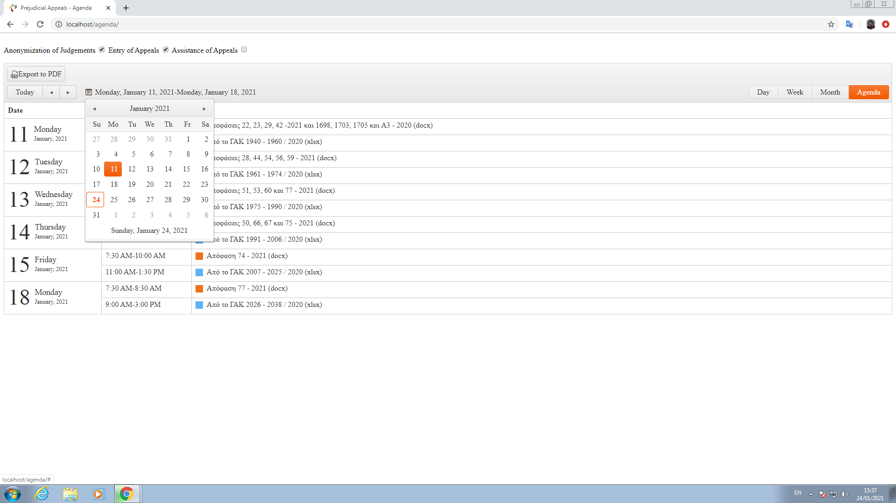

					                          Web Agenda app

This agenda app has been made via [KendoUI for PHP](https://www.telerik.com/php-ui), CRUD PHP REST API and [SQLite](https://sqlitestudio.pl/). The user is able to manipulate agenda tasks via CRUD with calendar GUI of daily, weekly, monthly or overall chronological order. Furthermore there is the option of pdf view via specific chronologic order as well as filtering with particular agenda task criteria.

**General view**

**Filter view**

**Overall view**

